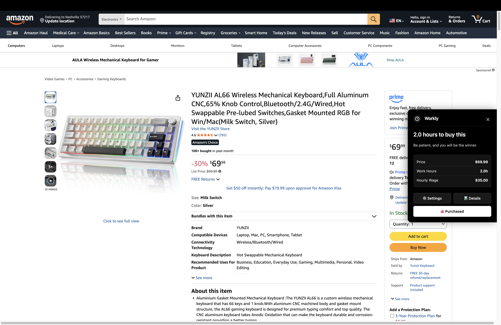
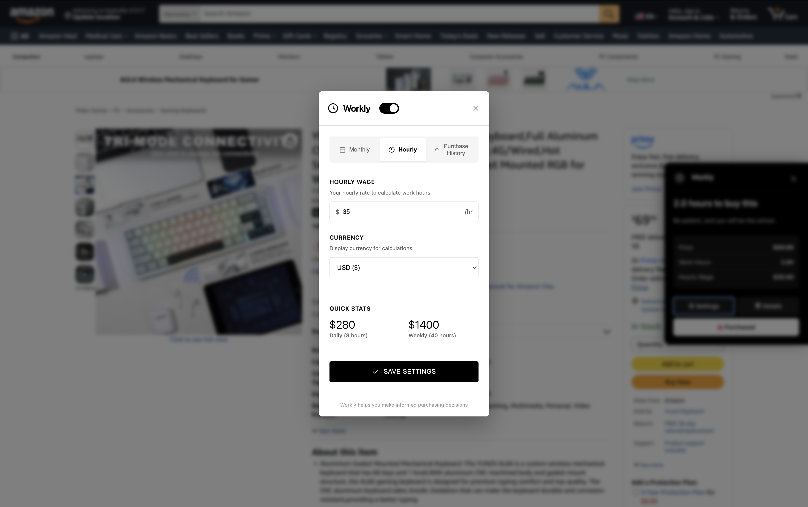
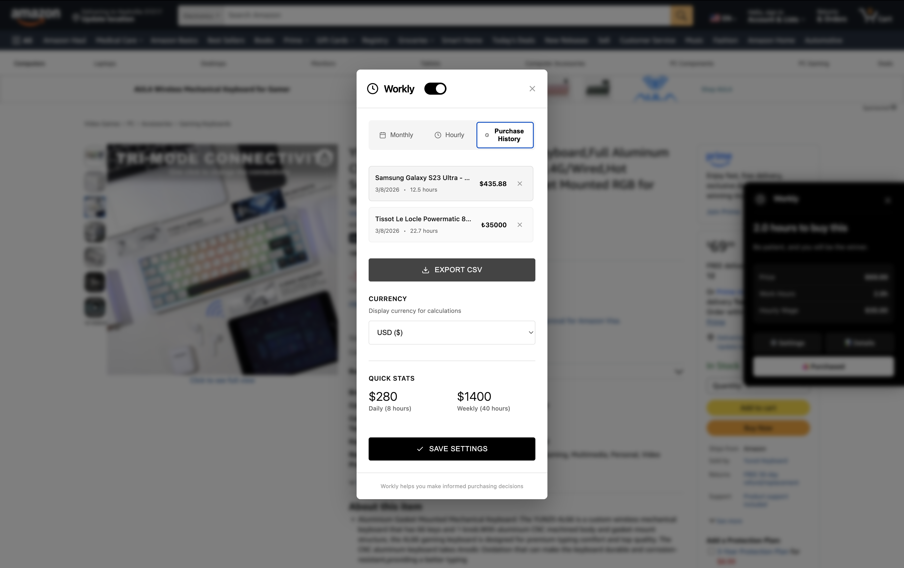
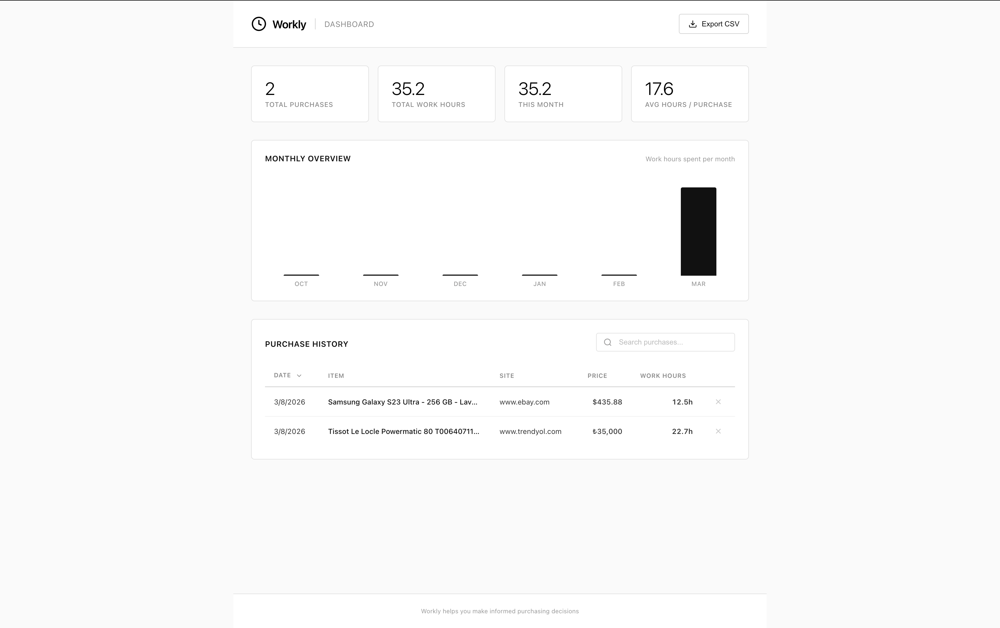

<p align="center">
  
</p>

<h1 align="center">Workly</h1>

<p align="center">
  A Chrome extension that shows how many hours you need to work to afford the product you're looking at.<br>
  Set your salary, browse any e-commerce site, and Workly will display the real cost of every item — in your time.
</p>

<p align="center">
  <a href="https://chromewebstore.google.com/detail/workly/kdlcocbedgeehenocbndmimnngaioifm"></a>
  <a href="https://chromewebstore.google.com/detail/workly/kdlcocbedgeehenocbndmimnngaioifm"></a>
  
  
  
  
  
</p>

## Screenshots

<p align="center">
  
  <br>
  <em>Workly shows how many work hours a product costs — right on the page</em>
</p>

<p align="center">
  
  &nbsp;&nbsp;
  
  <br>
  <em>In-page settings and purchase tracking — without leaving the site</em>
</p>

<p align="center">
  
  <br>
  <em>Full dashboard with monthly overview, stats, and searchable purchase history</em>
</p>

## Features

- **Automatic price detection** on product pages with inline widget display
- **Hourly & monthly salary** input with auto-calculated hourly rate
- **Real currency conversion** via exchange rate API with 6-hour caching
- **Multi-site support** with dedicated parsers for Trendyol, Hepsiburada, Amazon, N11, eBay, Etsy, plus a generic parser for other sites
- **Dashboard** — full-page view with monthly spending chart, summary stats, sortable purchase history, and search
- **Bilingual UI** — automatic language detection (Turkish & English) based on page content, domain, and browser settings
- **Purchase tracking** — mark items as purchased, track spending history, and monitor remaining monthly budget
- **CSV export** — download your purchase history as a spreadsheet
- **Badge icon** — extension badge shows work hours for the current product page
- **Motivational nudges** — random reflection messages encouraging mindful spending
- **Collapsible widget** — expand/collapse the sidebar widget; minimized state shows a floating icon
- **In-page settings modal** — change salary and view history without leaving the page
- **Privacy-first** — all data stored locally via `chrome.storage.sync`, no external tracking

## Supported Sites

| Site | Parser |
|------|--------|
| Trendyol | `parsers/trendyol.js` |
| Hepsiburada | `parsers/hepsiburada.js` |
| Amazon (.com.tr & .com) | `parsers/amazon.js` |
| N11 | `parsers/n11.js` |
| eBay | `parsers/ebay.js` |
| Etsy | `parsers/etsy.js` |
| Any other e-commerce site | `parsers/generic.js` |

Want to add support for a new site? See [Contributing](#contributing).

## Installation

### Chrome Web Store (recommended)

[**Install Workly**](https://chromewebstore.google.com/detail/workly/kdlcocbedgeehenocbndmimnngaioifm) from the Chrome Web Store.

### From source (for development)

1. Clone this repository:
   ```bash
   git clone https://github.com/mkrtlc/workly.git
   ```
2. Open `chrome://extensions/` in Chrome (or any Chromium-based browser)
3. Enable **Developer mode** (top right)
4. Click **Load unpacked** and select the project folder
5. Click the Workly icon in the toolbar to configure your salary

## Project Structure

```
workly/
├── manifest.json          # Chrome Extension manifest (v3)
├── background.js          # Service worker — install defaults, messaging, badge updates
├── content.js             # Main coordinator — initializes parsers, widget, and modules
├── widget.js              # Widget rendering, positioning, collapse/expand, events
├── purchase.js            # Purchase tracking, budget calculation, CSV export
├── settings-modal.js      # In-page settings modal (Shadow DOM)
├── currency.js            # CurrencyConverter — real exchange rates with caching
├── language.js            # LanguageManager — detection, translations (EN/TR)
├── content.css            # Widget styles (inline, fixed, expanded, collapsed)
├── popup.html/js/css       # Extension popup UI
├── dashboard.html/js/css   # Full-page purchase dashboard
├── parsers/
│   ├── base.js            # PriceParser — shared price extraction utilities
│   ├── trendyol.js        # Trendyol-specific selectors
│   ├── hepsiburada.js     # Hepsiburada-specific selectors
│   ├── amazon.js          # Amazon-specific selectors
│   ├── n11.js             # N11-specific selectors
│   ├── ebay.js            # eBay-specific selectors + JSON-LD fallback
│   ├── etsy.js            # Etsy-specific selectors
│   └── generic.js         # Fallback — Schema.org, meta tags, visual heuristics
└── icons/                 # Extension icons (16, 32, 48, 128px)
```

## How It Works

1. **Content scripts** are injected on every page. The `WorklyCalculator` uses a `MutationObserver` to detect price elements as they load.
2. **Parsers** (site-specific and generic) each define CSS selectors and JSON-LD extraction to locate and parse prices.
3. **CurrencyConverter** fetches real exchange rates if the product currency differs from your wage currency.
4. Once a price is found, the **WorklyWidget** renders a fixed sidebar showing work hours/minutes required.
5. **PurchaseTracker** lets you mark purchases and tracks monthly spending against your work hours budget.
6. The **Dashboard** provides a full-page view with monthly charts, stats, and searchable/sortable history.
7. **LanguageManager** checks the page's `lang` attribute, Turkish content indicators, and domain to auto-switch between TR and EN.

## Tech Stack

- Vanilla JavaScript (ES6+ classes, zero dependencies)
- Chrome Extensions API (Manifest V3)
- CSS3 with transitions and animations
- Shadow DOM for isolated in-page settings
- `chrome.storage.sync` for settings persistence

## Contributing

Contributions are welcome! See [CONTRIBUTING.md](CONTRIBUTING.md) for guidelines.

Some good ways to contribute:

- **Add a new site parser** — support a new e-commerce site (Walmart, AliExpress, Shopify stores, etc.)
- **Add a new language** — extend `language.js` with translations
- **Fix a parser** — e-commerce sites change their HTML frequently, parsers may need selector updates
- **Improve the dashboard** — charts, filters, new stats
- **Bug fixes** — check the [Issues](https://github.com/mkrtlc/workly/issues) tab

## Star History

<a href="https://www.star-history.com/?repos=mkrtlc%2Fworkly&type=date&legend=top-left">
 <picture>
   <source media="(prefers-color-scheme: dark)" srcset="https://api.star-history.com/image?repos=mkrtlc/workly&type=date&theme=dark&legend=top-left" />
   <source media="(prefers-color-scheme: light)" srcset="https://api.star-history.com/image?repos=mkrtlc/workly&type=date&legend=top-left" />
   
 </picture>
</a>
## License

MIT — see [LICENSE](LICENSE) for details.
